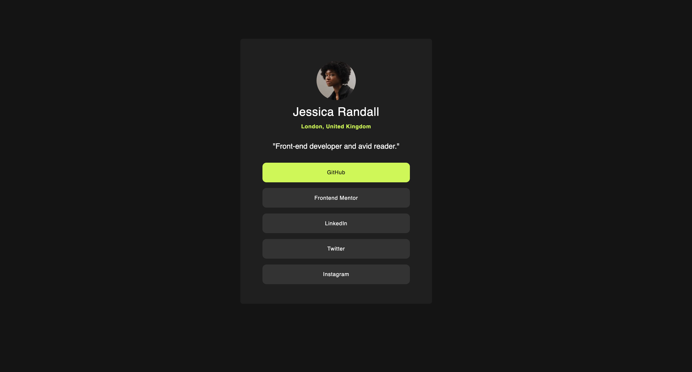

# Frontend Mentor - Social links profile solution

This is a solution to the [Social links profile challenge on Frontend Mentor](https://www.frontendmentor.io/challenges/social-links-profile-UG32l9m6dQ). Frontend Mentor challenges help you improve your coding skills by building realistic projects.

This is my second challenge in using flexbox.

## Overview

- [Overview](#overview)
  - [The challenge](#the-challenge)
  - [Screenshot](#screenshot)
- [My process](#my-process)
  - [Built with](#built-with)
  - [What I learned](#what-i-learned)
- [Author](#author)
- [Acknowledgments](#acknowledgments)

## The Challenge

Users should be able to:

- See hover and focus states for all interactive elements on the page

### Screenshot



- Solution URL: [GitHub Solution](https://github.com/hollyBelly2021/social-links-profile-main)

## My process

### Built with

- Semantic HTML5 markup
- CSS custom properties
- Flexbox

### What I learned

These are the things, I would like to take note of:

PROBLEM: Font weight doesn't affect h1 element when it is applied in a container that holds h1 element:

```html
<header class="header-styles">
  
  <h1 class="name-style">Jessica Randall</h1>
  <p class="address-style">London, United Kingdom</p>
</header>
```

```css
.header-styles {
  display: flex;
  flex-direction: column;

  align-items: center;

  margin-top: 45px;

  gap: 10px;
}

.name-style {
  font-weight: 400;
  letter-spacing: 0.5px;
}

.address-style {
  font-size: 11px;
  letter-spacing: 0.5px;
  font-weight: 600;

  color: hsl(75, 94%, 57%);
}
```

MY SOLUTION: apply the property in to its specific class, in this case it is address-style.

GOAL: I didn't want to hard code the width property. I wanted the width to automatically grow until it reaches its container.

```html
<div class="link-styles">
  <div class="links">GitHub</div>
  <div class="links">Frontend Mentor</div>
  <div class="links">LinkedIn</div>
  <div class="links">Twitter</div>
  <div class="links">Instagram</div>
</div>
```

```css
.link-styles {
  display: flex;
  flex-direction: column;
  flex-grow: 1;
  justify-content: space-between;
}

.links {
  display: flex;
  width: 300px;
  flex-basis: 40px;
  background-color: hsl(0, 0%, 20%);

  justify-content: center;
  align-items: center;

  font-size: 11px;
  font-weight: 400;
  letter-spacing: 0.5px;

  border-radius: 8px;
}
```

MY SOLUTION: I used flex-grow property in link-styles class.

NOTE: In links class, I used flex-basis: 40px to adjust the height of each divs (flex-basis grows the height because the parent container has a property of flex-direction: column) and because of that I was able to use align-items: center

## Author

- Github Profile - [GitHub](https://github.com/hollyBelly2021)
- LinkedIn Profile - [LinkedIn](www.linkedin.com/in/maea-matugas)

## Acknowledgments

I would like to acknowledge the author of this challenge.
